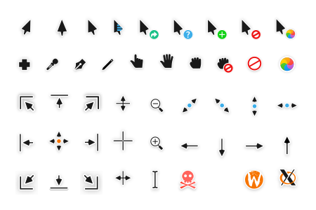
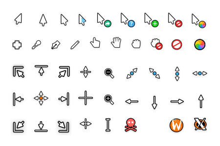

# Capitaine cursors

This is an x-cursor theme inspired by macOS and based on KDE Breeze.
The source files were made in Inkscape, and the theme was designed to pair well with my icon pack, [La Capitaine](https://github.com/keeferrourke/la-capitaine-icon-theme).

This cursor should scale appropriately for any display resolution.

## Preview

| Dark                            | Light                             |
| ------------------------------- | --------------------------------- |
|  |  |

## Supported DPIs

This cursor pack aims to support all [named pixel densities](https://en.wikipedia.org/wiki/Pixel_density#Named_pixel_densities).

| Name    | Build option name | Rendered density (DPI) | Scale          |
| :------ | :---------------- | :--------------------- | :------------- |
| LODPI   | `-d lo`           | 96-144                 | x1, 1.25, x1.5 |
| TVDPI   | `-d tv` (default) | 192                    | x2             |
| HDPI    | `-d hd`           | 240                    | x2.5           |
| XHDPI   | `-d xhd`          | 288                    | x3             |
| XXHDPI  | `-d xxhd`         | 384-480                | x4, x5         |
| XXXHDPI | `-d xxxhd`        | 576+                   | x6, x10        |

## Documentation

See docs [here](docs/Main.md).

## Pre-built binaries

Pre-built binaries are available for download at [pling.com](https://www.pling.com/p/1148692) :heart:

## Donations

If you like this cursor theme and want to support me, please consider [donating](https://paypal.me/keeferrourke).

## License

Capitaine cursors is currently using LGPLv3. See [COPYING](COPYING) for more details.
